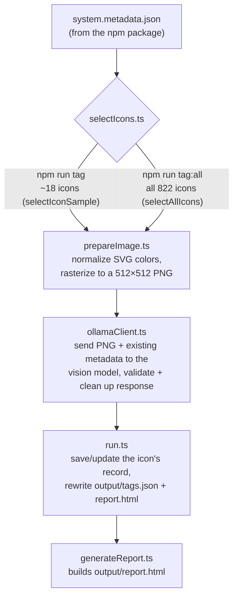
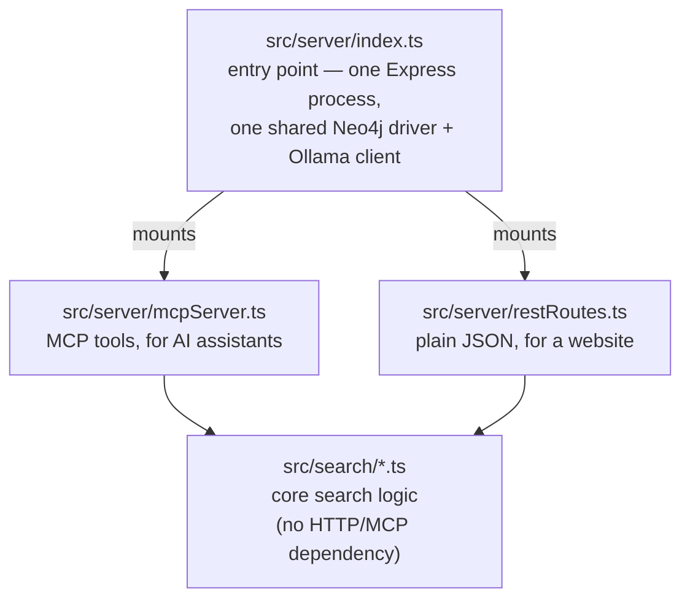

# Maintaining this project

This describes how the current pipeline (stages 2, 4, and 5 — see [README.md](./README.md) for the full 5-stage plan) actually works, the non-obvious decisions behind it, and where the sharp edges are. Update this file as the architecture changes or grows into later stages.

## Pipeline overview

There are two ways to run this:

- `npm run tag` — a small, fixed ~18-icon sample spread across every category. Fast (a few minutes), meant for testing prompt or code changes.
- `npm run tag:all` — every active icon (822 of them). Slow (hours) — this is the real production run.

Both run `src/run.ts`, which does this for every icon it's asked to process:

Everything lives in `src/`. There's no build step — both scripts run the TypeScript directly via [`tsx`](https://github.com/privatenumber/tsx) (an esbuild-based runner), and `npm run typecheck` runs `tsc --noEmit` separately just to check types.

## Search server overview (stage 5)

`npm run search-server` runs `src/server/index.ts`, which serves TWO interfaces on top of ONE shared search service:

Every search mode reaches the graph one of three ways: exact/prefix matching (name, category), a Neo4j full-text index (tag, and the keyword half of natural-language search), or the Neo4j vector index (the semantic half of natural-language search) -- see "Hybrid search architecture" below for how those three combine.

## File-by-file

- **`src/types.ts`** — the shared data shapes. Defines `IconMetadataEntry` (matches the npm package's metadata JSON exactly) and the [zod](https://zod.dev/) schemas for what we ask the model to produce. See "Two schemas, not one" below for why this file exports *two* related schemas instead of one.
- **`src/selectIcons.ts`** — decides which icons a run processes. `selectIconSample()` deterministically picks a small sample spread across all 11 categories (2 icons from the 7 largest categories, 1 from each of the remaining 4 = 18 total) — deterministic (alphabetical sort + fixed index math, no randomness) so re-running after a prompt change is an apples-to-apples comparison. `selectAllIcons()` just returns every active icon, sorted by name.
- **`src/prepareImage.ts`** — turns an icon's raw SVG text into a PNG buffer. Two steps: `normalizeSvg()` (color fixup, see "The oklch gotcha" below) and `rasterizeSvgToPng()` (renders via [`sharp`](https://sharp.pixelplumbing.com/) at a resolution high enough for the vision model to make out details clearly).
- **`src/ollamaClient.ts`** — the actual model call. Builds the prompt (existing metadata as grounding context + instructions on what to return), calls Ollama's chat API with the image attached, and validates/cleans the response. This is where most of the tag-quality logic lives — see "Cleaning up the model's output" below.
- **`src/generateReport.ts`** — builds the static `output/report.html` review page (no server, no framework — just a template string).
- **`src/run.ts`** — orchestrates the above: picks the icon set (sample or full, based on the `--all` CLI flag), resumes from whatever's already in `output/tags.json`, processes whatever's left, and saves progress after every icon. See "Saving progress after every icon" below.
- **`src/env.ts`** — loads `.env` (once, via Node's built-in `process.loadEnvFile()`) and exposes `getRequiredEnvVar()`/`getEnvVar()` helpers. Everything that needs a config value (Neo4j credentials, server port, the MCP API key) reads it from here, so `.env` loading only ever happens once regardless of which file imports it first.
- **`src/embeddingClient.ts`** — converts text into embeddings (number lists capturing meaning) via a local Ollama model, for the semantic-similarity half of hybrid search. See "Embeddings" below.
- **`src/graph/neo4jClient.ts`** — creates the Neo4j driver (connection pool) used by the ETL step and by search. Reads connection details from `.env` (see "Graph database connection" below).
- **`src/graph/schema.ts`** — creates every constraint and index the graph relies on: the three uniqueness constraints (stage 4), a vector index on `Icon.embedding`, and full-text indexes on `Tag.value` and Icon name/description fields (stage 5). All idempotent (`IF NOT EXISTS`).
- **`src/graph/loadGraph.ts`** — the ETL script (`npm run load-graph`). Upserts icons/tags/categories into Neo4j (stage 4) AND, since stage 5, generates and stores each icon's embedding in the same pass. See "Embeddings" below for why this lives here rather than a separate script.
- **`src/search/`** — the core search service, no HTTP or MCP dependency at all:
  - `types.ts` — `IconSearchResult` (the shared return shape for every search mode) and `CANONICAL_CATEGORIES`.
  - `luceneQuery.ts` — helpers for building Lucene query strings for the full-text indexes (escaping special characters, building fuzzy-or-exact queries).
  - `toIconSearchResult.ts` — converts one raw Neo4j driver `Record` into an `IconSearchResult`, in one place instead of copy-pasted into every search file.
  - `searchByName.ts`, `searchByCategory.ts`, `searchByTag.ts` — the three deterministic search modes.
  - `searchByNaturalLanguage.ts` — the hybrid mode; see "Hybrid search architecture" below.
  - `rankFusion.ts` — Reciprocal Rank Fusion, used by natural-language search to combine multiple ranked lists into one.
  - `getIconDetails.ts` — a lookup (not search) function returning one icon's full details (all tags/synonyms/use cases).
- **`src/server/`** — the two thin interfaces on top of `src/search/`:
  - `mcpServer.ts` — builds an MCP server exposing every search mode as a named tool.
  - `restRoutes.ts` — plain `GET /api/search/*` and `/api/icons/:name` JSON routes.
  - `auth.ts` — the static-API-key bearer-auth verifier for `/mcp`. See "Auth" below.
  - `index.ts` — the entry point (`npm run search-server`): creates the shared Neo4j driver, builds one Express app serving both interfaces, starts listening.

## Where the source data comes from

`@workday/canvas-system-icons-web` is installed as a regular npm dependency — its metadata JSON and SVGs are read straight out of `node_modules/`, resolved via `require.resolve('@workday/canvas-system-icons-web/package.json')` rather than a hardcoded path, so it keeps working across version bumps. See the npm package's `dist/metadata/system.metadata.json` (822 active icons) and `dist/svg/*.svg`.

## Notable decisions and gotchas

### The oklch gotcha

Every icon's SVG colors its shapes with the CSS `oklch(...)` color function rather than `currentColor` or a plain hex value. Several SVG rasterizers (including the one `sharp` uses internally) don't reliably support `oklch()`, and can render a shape as black, invisible, or throw. Since the exact shade doesn't matter for a tagging task, `normalizeSvg()` in `prepareImage.ts` just replaces every `oklch(...)` value with a plain hex color via a regex *before* handing the SVG to `sharp` — this sidesteps the compatibility problem entirely, regardless of which rasterizer is used.

### Two schemas, not one

`types.ts` exports both `GeneratedTagResponseShape` (no transforms) and `GeneratedTagSchema` (the same shape, plus a `.transform()` that dedupes list fields). This split exists because `z.toJSONSchema()` — used to build the `format` parameter that tells Ollama what JSON shape to produce — **throws if the schema contains a `.transform()`** (JSON Schema can describe a static shape, but has no way to express "then run this function on the result"). So:

- `GeneratedTagResponseShape` → passed to `z.toJSONSchema()` → tells Ollama what to generate
- `GeneratedTagSchema` → used only for `.parse()`-ing the model's response after we get it back

If you ever see a `Transforms cannot be represented in JSON Schema` error, this is why — check that `format:` in `ollamaClient.ts` is using the transform-free shape, not the one with `.transform()` attached.

### Structured output isn't fully trusted

Ollama's `format` parameter constrains the model's output, but this constraint has documented cases of not being perfectly respected ([ollama/ollama#8063](https://github.com/ollama/ollama/issues/8063)). So every response is still parsed and validated with `GeneratedTagSchema.parse()` regardless, and a validation failure is recorded (`generated: null`, `validationError` set, raw response kept) rather than crashing the whole batch.

### Cleaning up the model's output

Even with prompt instructions and structured-output constraints, the model reliably produces some noise. Three cleanup passes run on every response, in this order:

1. **Exact-duplicate removal** (`dedupeCaseInsensitive` in `types.ts`) — the model sometimes repeats the same value several times in a list (e.g. `["hold", "hold", "hold", ...]`). Runs as part of the zod `.transform()`, so it applies to `tags`, `synonyms`, and `useCases`.
2. **"icon" word stripping** (`ICON_WORD_PATTERN` in `ollamaClient.ts`) — tags like "person icon" get the redundant word "icon" stripped (→ "person"), since every entry in these lists already is an icon tag.
3. **Trailing style-word stripping** (`TRAILING_STYLE_WORD_PATTERN` in `ollamaClient.ts`) — tags ending in "shape", "silhouette", or "outline" (e.g. "human silhouette") have that qualifier stripped (→ "human"), since these describe *how* an icon is drawn (a flat monochrome shape), not what it depicts, and nearly every icon in this library qualifies.

Steps 2 and 3 only run on `tags` and `synonyms`, **not** `useCases` — those are full sentences (e.g. "confirm a destructive action"), and blindly stripping a word out of a sentence risks mangling it.

Each of these strips the *qualifier*, not the whole tag — e.g. "airplane silhouette" becomes "airplane" rather than being deleted outright. This matters: some icons only ever get a qualified form of a word from the model (no bare "airplane" tag at all, only "airplane silhouette"/"airplane shape") — deleting those tags outright would remove that search term entirely.

After steps 2 and 3, `dedupeCaseInsensitive()` runs again, since stripping qualifiers can turn previously-distinct tags into duplicates of each other (e.g. "human shape" and "human outline" both become "human").

Also stripped: any tag/synonym that just repeats the icon's own internal name or Figma layer name (`buildIconNameVariants` in `ollamaClient.ts`) — exact-name lookup is expected to be handled separately from tag-based search, so a tag that duplicates the name doesn't add a new way to find the icon.

**What's intentionally NOT handled**: near-synonym clusters that aren't exact duplicates or shape/silhouette/outline variants (e.g. an icon with both "human figure" and "human" as separate tags). A prompt-only attempt to reduce this didn't work reliably, and a fuzzy/semantic dedup pass was deliberately ruled out as too likely to produce false positives for the value it'd add. If this becomes a real problem at scale, revisit — but don't reach for a semantic-similarity solution without a good way to verify it isn't over-merging distinct concepts.

### Saving progress after every icon

`npm run tag:all` processes ~800 icons at roughly 20-40 seconds each — several hours, unattended. Losing that progress to an interrupted process (laptop sleeps, terminal closes, Ollama restarts) would be a real problem, so `run.ts` is built to make that safe:

- **Resumable**: at startup, `loadExistingRecords()` reads whatever's already in `output/tags.json` (from any earlier run) into a map keyed by icon name. Any icon that already has a *successful* record (`generated !== null`) is skipped rather than re-queried. A failed icon is retried automatically, since a failure never gets recorded.
- **Never silently drops unrelated results**: `saveOutputs()` always writes out the *full* accumulated map, not just the icons the current run touched. So running the small sample (`npm run tag`) after a full run doesn't shrink `output/tags.json` back down to 18 records — it only touches the icons it was actually asked to process.
- **Saved after every single icon**, not just at the end — the worst case if something goes wrong is losing progress on the one icon that was in flight, not the whole run.
- **Atomic writes** (`writeFileAtomically()`): each save writes to a `.tmp` file and then renames it over the real target. A rename is one filesystem operation, so a process killed mid-write can't leave `output/tags.json` half-written/corrupted — you either get the old complete file or the new complete file, never something in between.
- **Circuit breaker**: if 5 icons in a row fail, the run stops with a clear message instead of grinding through the rest of the list with near-instant failures (the usual cause is Ollama itself having stopped responding, not a problem with any single icon). Just restart the command once Ollama's back — it resumes automatically.

One thing this does NOT protect against: running two `tag`/`tag:all` processes at the same time. They'd race on `output/tags.json` (each individual write is atomic, but the two processes' accumulated in-memory state would clobber each other's progress). Not worth a lock file for a single-developer project — just don't do that.

### `output/tags.json` and `output/report.html` are committed, `output/images/` isn't

Deliberate: `tags.json` is the one artifact expensive enough (hours of sequential vision-model calls) to be worth checking into git, so cloning this repo doesn't require re-running `tag:all` just to get a working graph — `npm run load-graph` alone is enough. `report.html` is committed alongside it since it's just a rendering of the same data, at negligible extra size. `output/images/` stays gitignored because it's the opposite case: hundreds of PNG files, trivially and near-instantly regenerable from the SVGs already vendored in `node_modules`, with no reproducibility value to versioning them.

Both `tag` and `tag:all` were deliberately *not* renamed to something like `regenerate-tags` despite `tags.json` now being pre-populated — their resumable/incremental behavior (skip anything already tagged, retag only what's new or failed) is identical whether it's the very first run or the hundredth, so a name implying "regenerate from scratch" would actually overstate what they do. The optionality (you don't need to run these just to search) is documented in the README instead of baked into the script name.

### Model and runtime choice

Vision model is [`qwen2.5vl:7b`](https://ollama.com/library/qwen2.5vl) via [Ollama](https://docs.ollama.com/), chosen over Molmo (the other candidate considered) because Ollama has official Qwen2.5-VL support with real quantized weights, while Molmo has no official Ollama support and only stale, unofficial community conversions. Runs comfortably on a 16 GB Apple Silicon Mac.

### Graph database connection

Chosen over alternatives (Kuzu was the main one considered — an embedded, no-server graph DB) mainly for the ecosystem/maturity and because the query skills (Cypher) transfer directly to the larger, more complex knowledge-graph project this one is a warm-up for. **You don't need to know Java to work with it** — everything here goes through Cypher and the `neo4j-driver` npm package; Java is just the language the server itself is built in, same as not needing Go to run Ollama.

- Installed locally via Homebrew (`brew install neo4j`), running as a `brew services` background process, same operational pattern as Ollama.
- `src/graph/neo4jClient.ts` creates the driver (a connection pool — create one per process, not one per query) using connection details from environment variables, loaded from a local `.env` file via Node's built-in `process.loadEnvFile()` (no `dotenv` package needed). `.env` is git-ignored; `.env.example` documents the required variables and is committed.
- Neo4j requires changing the default password before first use. There's no clean way to do this non-interactively through `cypher-shell` (its `--change-password` flag expects an interactive terminal), so the setup instructions in the README use a direct HTTP call to Neo4j's transactional Cypher endpoint (`POST /db/system/tx/commit` against the `system` database) running `ALTER CURRENT USER SET PASSWORD FROM ... TO ...` instead.
- Visual exploration: Neo4j Browser, bundled with the server, at `http://localhost:7474` — no separate install.

### Embeddings

`src/embeddingClient.ts` uses [`nomic-embed-text:v1.5`](https://ollama.com/library/nomic-embed-text) via Ollama (274MB, 768-dimensional output, small/fast enough to run continuously alongside `qwen2.5vl:7b`) — chosen over other small embedding models (`mxbai-embed-large`, `all-minilm`) mainly for its combination of quality and generous context window, and because it's the most widely used/best-documented option in the Ollama ecosystem.

Two things easy to get wrong with this specific model:
- **Task-instruction prefixes are required, not optional.** Nomic's own model card says retrieval quality suffers measurably without prefixing every input with `"search_document: "` (content being indexed) or `"search_query: "` (a live user query) — `embeddingClient.ts` bakes this in so no other file has to remember it.
- **Dimensions must match the vector index exactly.** `EMBEDDING_DIMENSIONS` (768) is exported from `embeddingClient.ts` and imported by `graph/schema.ts` specifically so there's one source of truth — if you ever switch embedding models, this is the one place that has to change, and the vector index would need to be dropped and recreated (a running index can't have its dimensions changed in place).

Embeddings are generated as part of `npm run load-graph` (in `graph/loadGraph.ts`), not a separate script — by the time that ETL runs, every field an embedding needs (name, category, tags, synonyms, description, use cases) is already assembled in memory; a separate script would just redo that work. They're recomputed on **every** run, for **every** icon (no "skip if already embedded" check) — consistent with the ETL's existing "replace, don't diff" philosophy, and cheap (embedding ~800 short texts locally takes seconds). If embedding a batch fails (e.g. Ollama briefly down), that's logged and those icons load without an embedding rather than aborting the whole run — see `generateDocumentEmbeddings()`'s `null`-entry handling.

`buildEmbeddingText()` in `loadGraph.ts` is the one place that decides what text actually gets embedded per icon — if similarity search ever feels like it's missing something obvious, check there first.

### Hybrid search architecture

Four search modes, three different techniques:

- **Name** (`searchByName.ts`) — exact/prefix match first (fast, correct for the common case); falls back to a fuzzy full-text query only if that finds nothing (handles typos).
- **Category** (`searchByCategory.ts`) — plain exact match; there are only 11 categories and membership isn't a matter of degree, so there's no ranking to speak of.
- **Tag** (`searchByTag.ts`) — one full-text query does exact-boosted-over-fuzzy matching in a single round trip (see `buildFuzzyOrExactQuery` in `luceneQuery.ts`).
- **Natural language** (`searchByNaturalLanguage.ts`) — the actual "hybrid search": runs a full-text query over tags, a full-text query over icon name/description text, and a vector similarity query over embeddings, **in parallel, as three separate simple queries**, then merges the three ranked lists with Reciprocal Rank Fusion (`rankFusion.ts`).

**Why three separate queries + TypeScript-side fusion, instead of one Cypher query with `UNION ALL`** (which is what Neo4j's own hybrid-search guide demonstrates): Cypher is new territory in this project, and at this scale (roughly 800 Icon + 1000 Tag nodes) either approach is instant — so the deciding factor was that `rankFusion.ts` as a plain, dependency-free function is much easier to read and unit-test in isolation than an equivalent fused Cypher query with nested `WITH`/`collect`/`UNWIND range` bookkeeping. If this ever needs to scale well past thousands of nodes, revisit and consider pushing the fusion into Cypher.

**Vector query syntax**: uses the current, non-deprecated `MATCH (i:Icon) SEARCH i IN (VECTOR INDEX iconEmbeddings FOR $queryVector LIMIT n) SCORE AS score` clause (needs `CYPHER 25`, which this project's Neo4j install already defaults to — the older `db.index.vector.queryNodes()` procedure still works but is deprecated). This exact syntax was confirmed against this project's real, running Neo4j instance (via `EXPLAIN`) before being used here, not copied from docs alone.

**Full-text analyzer — a real gotcha, found by testing, not by reading docs**: Neo4j's *default* full-text analyzer is confusingly named `standard-no-stop-words`, and (despite what the name implies) filters **no** stop words at all. Querying with a whole natural-language phrase like "something for flying in the sky" against an index using that default analyzer matches on words like "the" and "of" as if they were meaningful search terms — confirmed directly: it surfaced icons tagged "day of the month" ahead of genuinely relevant ones. Both full-text indexes in `graph/schema.ts` explicitly set `fulltext.analyzer: 'english'` (real stop-word filtering + light stemming) to fix this. If a full-text index's analyzer setting is ever changed, existing indexes must be **dropped and recreated** — `CREATE FULLTEXT INDEX ... IF NOT EXISTS` silently does nothing if an index by that name already exists, even with different options.

**A related bug worth knowing about if you're writing a new full-text query**: `buildFuzzyOrExactQuery()` (in `luceneQuery.ts`) wraps its input as one quoted exact phrase plus one whole-string fuzzy term — correct for a single word like a tag name, but wrong for a multi-word phrase (an exact-phrase match on a whole sentence essentially never hits, and Lucene's `~` fuzzy operator only applies to the single preceding token, not the whole phrase). `searchByNaturalLanguage.ts` uses plain `escapeLucene()` instead, letting Lucene's default parser treat the phrase as an OR of its individual words. Use `buildFuzzyOrExactQuery` for single terms (tags), plain `escapeLucene` for whole phrases (natural-language queries).

**Cypher gotcha, same category as the one in `graph/loadGraph.ts`'s `replaceRelationships()`**: `getIconDetails.ts` originally ran two `OPTIONAL MATCH` clauses (tags, then synonyms) back to back with no aggregation in between — for an icon with N tags and M synonyms, that produces an N×M cross-product of rows before `collect(DISTINCT ...)` cleans it up. Doesn't corrupt the final result, just wastes work. Fixed the same way as before: aggregate (`collect(DISTINCT ...)`) immediately after each `OPTIONAL MATCH`, via its own `WITH`, so cardinality collapses back to one row before the next `OPTIONAL MATCH` ever runs. Watch for this pattern (two or more independent one-to-many relationships fetched in the same query) anywhere else new Cypher gets written.

### MCP server (v2 SDK)

Built against `@modelcontextprotocol/server@2.0.0` (not the older `@modelcontextprotocol/sdk@1.x`) — v2 is positioned as the current stable line, though it's new enough (a few weeks old at the time this was built) that community documentation is sparse. Every API surface actually used here (`McpServer.registerTool`, `createMcpHandler`, `createMcpExpressApp`, `requireBearerAuth`, `toNodeHandler`, `OAuthTokenVerifier`) was verified directly against the real installed package's compiled type definitions and JS before being used, not assumed from research alone. If the SDK's API ever seems to have changed further, that's the first place to re-check — `src/search/*.ts` has zero dependency on the MCP SDK either way, so a v1-vs-v2 issue only ever affects `src/server/*.ts`.

One easy-to-miss finding from that verification: `AuthInfo.expiresAt` is typed as *optional* in the SDK, but its compiled request-handling code throws `"Token has no expiration time"` if a verifier omits it — confirmed by reading the actual compiled JS, not just the type file. `auth.ts`'s static-key verifier always sets it (one year out, since a static key doesn't really "expire").

**Stateless-by-default serving model**: `createMcpHandler`'s factory function runs fresh on *every single HTTP request* — this is the right model for "many unrelated concurrent clients" (no session store, scales behind any plain load balancer), but it means the Neo4j driver must be created once at module scope in `server/index.ts` and passed into `buildMcpServer()`, never created inside the factory itself.

### Auth and CORS

- **`/mcp` requires a bearer token** matching `MCP_API_KEY` (checked in `server/auth.ts`). This is a deliberate placeholder, not a finished security story: the MCP spec ultimately wants OAuth 2.1 (a separate authorization server, token rotation, PKCE), which is real infrastructure not justified before there's more than one or two trusted AI-assistant clients. Swapping in real OAuth later only means writing a different `OAuthTokenVerifier` — nothing about how it's wired into `server/index.ts` needs to change.
- **`/api/*` (REST) is intentionally unauthenticated.** There's nowhere to safely hide a bearer secret in public browser JavaScript, so bearer auth wouldn't actually protect anything there — CORS (restricting which origins can call it) is the real control for a browser-facing endpoint. `CORS_ALLOWED_ORIGINS` in `.env` controls this.
- **No rate-limiting yet** on the REST routes — fine for local/internal testing, a real gap before this is ever exposed on the public internet. Flagged, not built, since it wasn't needed to validate the architecture.
- **One Express process serves both interfaces** (`server/index.ts`) rather than two separate processes, since both need the exact same Neo4j driver and Ollama client — splitting them would mean duplicating that setup, or building a way to share it, for no benefit at this scale.

## Extending this later

- **Deprecated icons**: not handled at all yet — `npm run tag:all` only covers the 822 *active* icons, so they're absent from search entirely. `system.deprecated.metadata.json` has the same shape as the active metadata plus `deprecated: true` and a `fallback` field (the replacement icon's filename). If these get tagged and loaded too, they'd likely want their own relationship (e.g. `(:Icon)-[:REPLACED_BY]->(:Icon)`) so a search hit on a deprecated icon can point to its replacement — purely additive to the existing schema.
- **Staging/review (stage 3)**: `output/tags.json` currently serves as a minimal stand-in — plain, diffable JSON, no database. `graph/loadGraph.ts` loads every icon with `generated !== null`, i.e. "successfully tagged," not "human-approved" — there's no approval step in between yet. A real staging step would need to change what the ETL reads from.
- **Rate-limiting and real OAuth**: both explicitly deferred (see "Auth and CORS" above) — needed before the search server is exposed beyond local/internal use.
- **Ranking quality**: the natural-language mode's Reciprocal Rank Fusion is a reasonable first pass, not a tuned system — if certain queries consistently surface poor matches, the fusion constant (`k` in `rankFusion.ts`, currently 60) and the relative weight given to each of the three underlying lists are the places to experiment first, before reaching for a different embedding model or index strategy.
- **Near-synonym tag clusters**: still not addressed (see the tagging-stage note above) — this would also affect the tag-value full-text index (e.g. "human figure" and "human silhouette" as separate Tag nodes rather than one).
